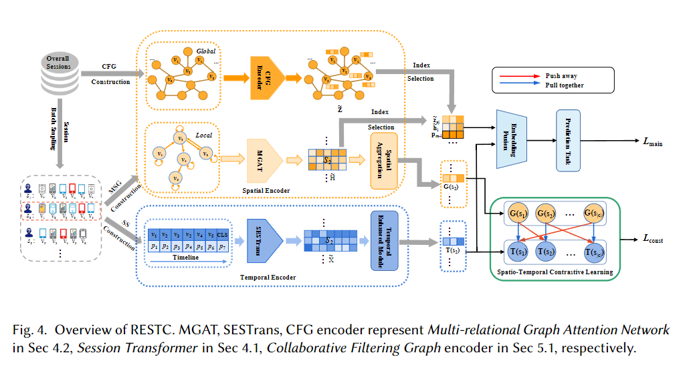
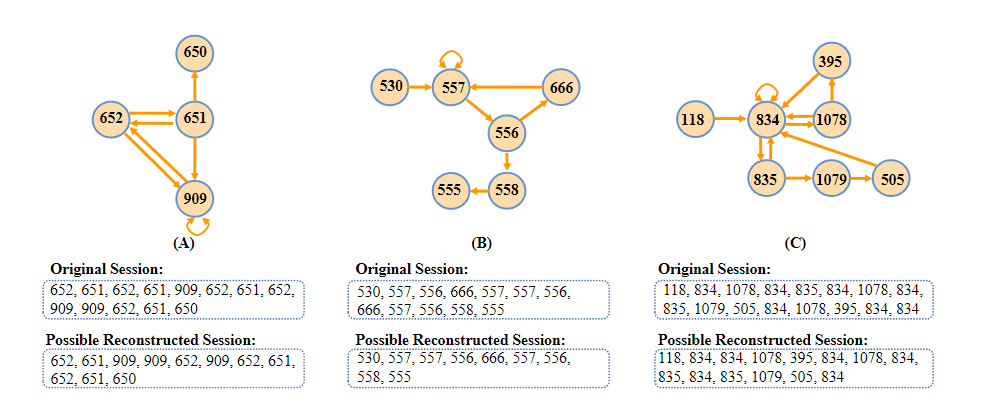

# RESTC-Source-code
Source code of ACM TOIS accepted paper "Spatio-Temporal Contrastive Learning Enhanced GNNs for Session-based Recommendation"
Framework Pipeline 

# Concise Runing Steps:

- Preprocess the datasets following the format of https://github.com/CCIIPLab/GCE-GNN.
- Run train_main_global.py.

  Data samples 

# Citation:
```
@article{wan2022spatio,
  title={Spatio-temporal contrastive learning enhanced gnns for session-based recommendation},
  author={Wan, Zhongwei and Wang, Benyou and Liu, Xin and Qiu, Jiezhong and Li, Boyu and Guo, Ting and Chen, Guangyong and Wang, Yang},
  journal={arXiv preprint arXiv:2209.11461},
  year={2022}
}
```
